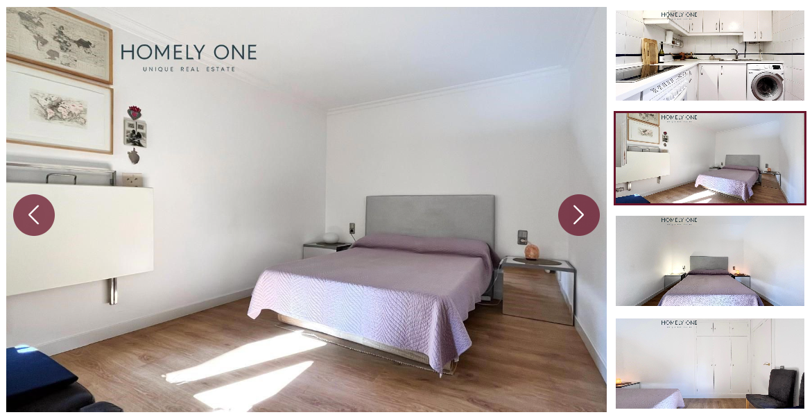

# Homely Property Slider for Elementor

A high-performance, responsive property gallery slider widget for Elementor Pro. Designed specifically for real estate listings, it features a primary focal slider with a synchronized vertical thumbnail track.

## Features

- **Dynamic Data Support**: Fully compatible with Elementor Dynamic Tags (ACF Gallery, JetEngine, etc.).
- **Dual-Slider Sync**: Primary main slider synced with a vertical thumbnail navigation.
- **Interaction Options**: Supports drag/swipe, click-to-sync, and standard navigation arrows.
- **Smart Responsive Design**: Automatically switches from a vertical thumbnail track on desktop to a horizontal layout on mobile devices.
- **Performance Optimized**: Uses Swiper.js (Elementor's native library) with observers to ensure correct rendering even in complex layouts.

## Installation

1. Download the plugin as a `.zip` file.
2. In your WordPress Dashboard, go to **Plugins > Add New > Upload Plugin**.
3. Select the zip file and click **Install Now**.
4. **Activate** the plugin.

## Usage

1. Open any page or template in Elementor.
2. Search for the **Property Gallery Slider** widget.
3. Drag the widget into your section.
4. Under the **Content** tab, select your images or click the **Dynamic Tags** icon to link to an ACF or JetEngine gallery field.

## Requirements

- WordPress 5.0+
- Elementor (Free or Pro)

## Technical Details

- **Swiper.js Integration**: Leverages Elementor's internal Swiper assets for minimal footprint.
- **Observer Mode**: Includes `observer` and `observeParents` settings to prevent "blank slider" issues during AJAX loads or hidden tab rendering.
- **Custom CSS**: Minimal scoped CSS for layout stability.

---

**Author:** Mahbub  
**Version:** 1.3.0
